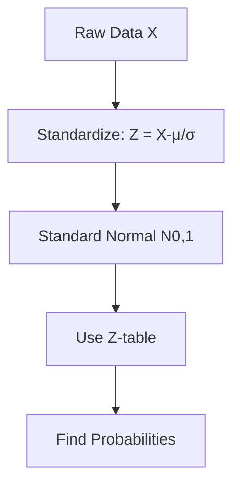
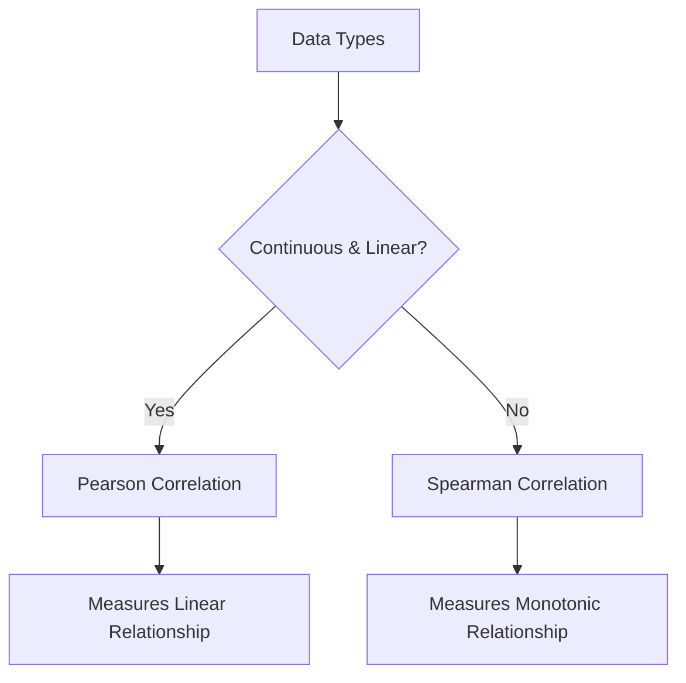
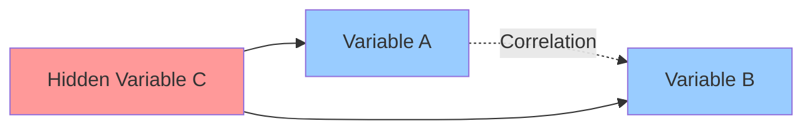
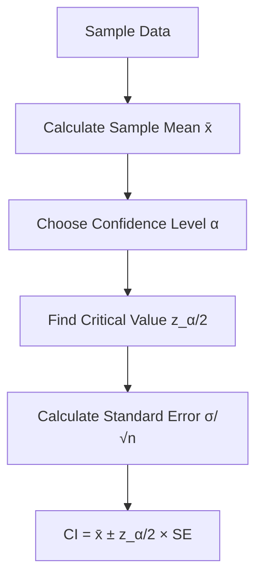
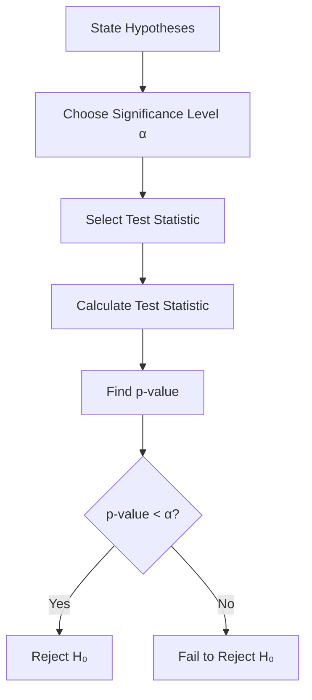
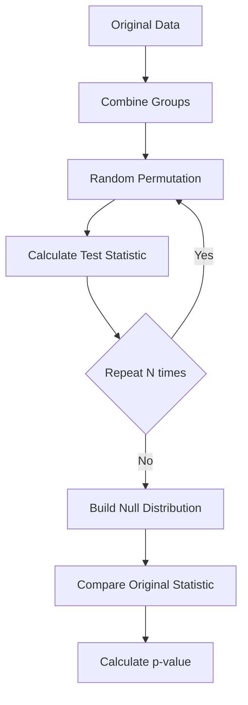

# Introduction to Probability and Statistics - UNIT_1

## Topic Importance Classification

### **HIGHEST PRIORITY (Essential for ML)**
1. **Gaussian/Normal Distribution and their PDF's and CDF's** ⭐⭐⭐⭐⭐
   - Foundation for many ML algorithms (Linear Regression, Naive Bayes, etc.)
   - Central Limit Theorem applications

2. **Population and Sample** ⭐⭐⭐⭐⭐
   - Fundamental concept for data science
   - Essential for understanding bias and generalization

3. **Hypothesis Testing Methodology** ⭐⭐⭐⭐⭐
   - Core statistical inference concept
   - Critical for model validation and A/B testing

4. **p-value and Null Hypothesis** ⭐⭐⭐⭐⭐
   - Essential for statistical significance testing
   - Widely used in research and industry

### **HIGH PRIORITY (Very Important)**
5. **Confidence Interval (C.I) Introduction & Computing** ⭐⭐⭐⭐
   - Important for uncertainty quantification
   - Used in model performance evaluation

6. **Pearson Correlation Coefficient** ⭐⭐⭐⭐
   - Feature selection and relationship analysis
   - Prerequisite for many ML concepts

7. **Correlation vs Causation** ⭐⭐⭐⭐
   - Critical thinking skill for data scientists
   - Prevents misinterpretation of results

### **MODERATE PRIORITY (Important but Specialized)**
8. **Confidence Interval using Bootstrapping** ⭐⭐⭐
   - Advanced technique for non-parametric CI
   - Useful when distribution assumptions fail

9. **Resampling and Permutation Test** ⭐⭐⭐
   - Non-parametric statistical testing
   - Useful for complex scenarios

10. **Kolmogorov-Smirnov (KS) Test** ⭐⭐⭐
    - Distribution comparison technique
    - Specialized but important for data validation

### **LOWER PRIORITY (Specialized Applications)**
11. **Co-variance** ⭐⭐
    - Important but often covered implicitly with correlation
    - Foundation concept but limited direct application

12. **Spearman Rank Correlation Coefficient** ⭐⭐
    - Specialized for non-linear relationships
    - Less frequently used than Pearson

13. **Proportional Sampling** ⭐⭐
    - Specific sampling technique
    - Important for survey design but limited ML application

---

## Detailed Study Notes

### 1. Population and Sample 🎯

**Definition:**
- **Population**: Complete set of all possible observations
- **Sample**: Subset of population used for analysis

**Key Concepts:**
- **Parameter**: Numerical characteristic of population (μ, σ)
- **Statistic**: Numerical characteristic of sample (x̄, s)
- **Sampling Bias**: When sample doesn't represent population

```
Population (N) → Sample (n) → Inference → Generalization
     ↓              ↓           ↓            ↓
Parameters      Statistics   Estimates    Conclusions
```

**Types of Sampling:**
- Random Sampling
- Stratified Sampling
- Cluster Sampling
- Systematic Sampling

---

### 2. Gaussian/Normal Distribution 📊

**Mathematical Definition:**
- **PDF**: f(x) = (1/√(2πσ²)) × e^(-(x-μ)²/2σ²)
- **CDF**: Φ(x) = ∫_{-∞}^x f(t)dt

**Properties:**
- Mean = Median = Mode = μ
- 68-95-99.7 Rule (Empirical Rule)
- Symmetric about mean
- Total area under curve = 1

**Standard Normal Distribution:**
- μ = 0, σ = 1
- Z = (X - μ)/σ (Standardization)



**ML Applications:**
- Linear Regression assumptions
- Naive Bayes classifier
- Central Limit Theorem
- Error distributions

---

### 3. Correlation Analysis 🔗

#### Pearson Correlation Coefficient (r)

**Formula:** r = Σ[(xi - x̄)(yi - ȳ)] / √[Σ(xi - x̄)²Σ(yi - ȳ)²]

**Properties:**
- Range: -1 ≤ r ≤ 1
- r = 1: Perfect positive correlation
- r = -1: Perfect negative correlation
- r = 0: No linear correlation

#### Spearman Rank Correlation (ρ)

**Formula:** ρ = 1 - (6Σdi²)/(n(n²-1))

**When to Use:**
- Non-linear relationships
- Ordinal data
- Presence of outliers



#### Covariance

**Formula:** Cov(X,Y) = E[(X-μx)(Y-μy)]

**Relationship:** r = Cov(X,Y)/(σx × σy)

---

### 4. Correlation vs Causation ⚖️

**Key Principle:** Correlation ≠ Causation

**Common Fallacies:**
1. **Post Hoc Fallacy**: A before B doesn't mean A causes B
2. **Confounding Variables**: Hidden factors affecting both variables
3. **Reverse Causation**: B might cause A instead of A causing B



**Establishing Causation:**
- Randomized Controlled Trials
- Natural Experiments
- Instrumental Variables
- Causal Inference Methods

---

### 5. Confidence Intervals 📈

#### Basic Concept

**Definition:** Range of values likely to contain the true population parameter

**General Form:** Estimate ± (Critical Value × Standard Error)

#### CI for Mean (Known σ)

**Formula:** x̄ ± z_(α/2) × (σ/√n)

**Process:**
1. Choose confidence level (90%, 95%, 99%)
2. Find critical value from Z-table
3. Calculate margin of error
4. Construct interval



#### CI using Bootstrapping

**Process:**
1. Resample with replacement (B times)
2. Calculate statistic for each resample
3. Sort the B statistics
4. Use percentiles for CI bounds

**Advantages:**
- No distributional assumptions
- Works for complex statistics
- Robust method

---

### 6. Hypothesis Testing 🔬

#### Methodology Framework



#### Key Components

**1. Null Hypothesis (H₀):**
- Statement of no effect/difference
- Assumes status quo
- What we test against

**2. Alternative Hypothesis (H₁):**
- Statement we want to prove
- Can be one-tailed or two-tailed

**3. p-value:**
- Probability of observing data as extreme as observed, given H₀ is true
- Lower p-value = stronger evidence against H₀

#### Coin Toss Example

**Scenario:** Is a coin fair?
- H₀: p = 0.5 (coin is fair)
- H₁: p ≠ 0.5 (coin is biased)
- Test: Flip coin 100 times, observe 65 heads
- Calculate: p-value using binomial test
- Decision: If p-value < 0.05, reject H₀

---

### 7. Advanced Testing Methods 🧪

#### Resampling and Permutation Tests

**Permutation Test Process:**
1. Combine all observations
2. Randomly reassign group labels
3. Calculate test statistic
4. Repeat many times
5. Compare original statistic to permutation distribution



#### Kolmogorov-Smirnov Test

**Purpose:** Test if two samples come from same distribution

**Test Statistic:** D = max|F₁(x) - F₂(x)|

**Applications:**
- Distribution comparison
- Goodness-of-fit testing
- Data validation

#### Proportional Sampling

**Concept:** Sample size from each stratum proportional to stratum size

**Formula:** nᵢ = n × (Nᵢ/N)

**Advantages:**
- Maintains population proportions
- Simple to implement
- Unbiased estimates

---

## Study Strategy 📚

### High Priority Focus (80% study time):
1. Master normal distribution properties and applications
2. Understand hypothesis testing framework completely
3. Practice correlation analysis and interpretation
4. Learn confidence interval construction

### Moderate Priority (15% study time):
1. Bootstrap methods for robust inference
2. Non-parametric testing approaches
3. Advanced correlation measures

### Lower Priority (5% study time):
1. Specialized sampling techniques
2. Distribution comparison tests

---

## Practice Problems Framework 💡

1. **Distribution Problems:**
   - Calculate probabilities using normal distribution
   - Standardization exercises
   - Real-world applications

2. **Correlation Analysis:**
   - Calculate different correlation measures
   - Interpret correlation matrices
   - Identify causation fallacies

3. **Hypothesis Testing:**
   - Design appropriate tests
   - Interpret p-values correctly
   - Avoid common statistical errors

4. **Confidence Intervals:**
   - Construct CIs for different parameters
   - Bootstrap implementation
   - Interpretation of interval meanings

---

## Key Formulas Summary 📋

| Concept | Formula | Notes |
|---------|---------|-------|
| Standard Normal | Z = (X-μ)/σ | Standardization |
| Pearson r | r = Σ[(xi-x̄)(yi-ȳ)]/√[Σ(xi-x̄)²Σ(yi-ȳ)²] | Linear correlation |
| CI for mean | x̄ ± z_(α/2) × (σ/√n) | Known population σ |
| t-statistic | t = (x̄-μ)/(s/√n) | Unknown population σ |
| KS statistic | D = max\|F₁(x) - F₂(x)\| | Distribution comparison |

Remember: Understanding concepts > Memorizing formulas!
