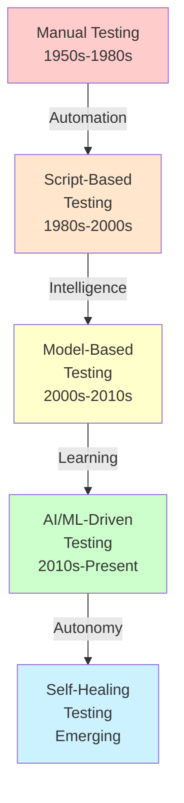
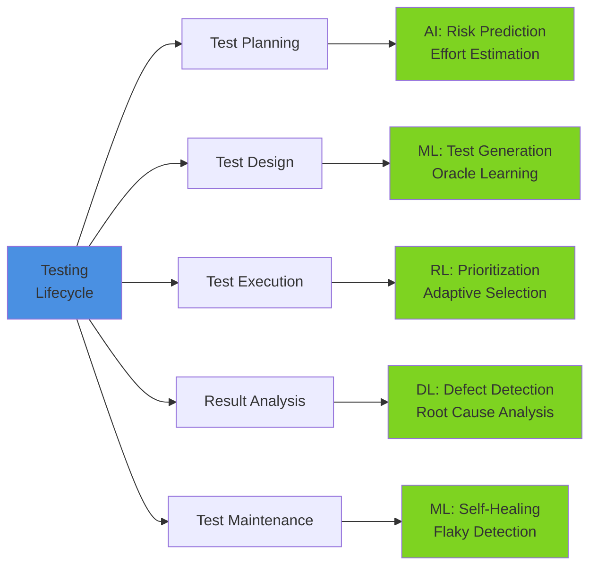
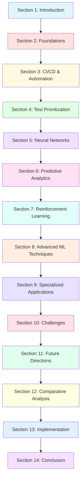

# AI and Machine Learning-Driven Continuous and Automated Software Testing: A Comprehensive Review

## 1. Introduction

### 1.1 Background and Motivation

Software testing has become increasingly critical as modern applications grow in complexity, scale, and deployment frequency. Traditional manual testing approaches struggle to keep pace with rapid development cycles, while conventional automated testing frameworks face significant challenges in test maintenance, prioritization, and effectiveness.

**Key Challenges in Modern Software Testing:**

The software industry confronts several pressing challenges that motivate the adoption of AI/ML approaches:

- **Exponential Growth in Test Suites**: Large-scale software projects often maintain thousands to millions of test cases, making exhaustive execution impractical within CI/CD timeframes
- **Resource Constraints**: Testing budgets face limitations in time, computational resources, and human expertise
- **Rapid Release Cycles**: DevOps and Agile methodologies demand faster testing turnaround without compromising quality
- **Complex System Behaviors**: Modern distributed systems, microservices architectures, and AI-powered applications exhibit non-deterministic behaviors difficult to capture with rule-based testing
- **Test Maintenance Overhead**: Studies indicate that 40-50% of testing effort goes into maintaining existing test suites
- **Oracle Problem**: Determining expected outcomes for complex systems remains a fundamental challenge

**The Promise of AI/ML Integration:**

Artificial Intelligence and Machine Learning offer transformative capabilities to address these challenges:

1. **Intelligent Test Prioritization**: ML models can learn from historical execution data to predict test case effectiveness and optimize execution order
2. **Automated Defect Prediction**: Deep learning models analyze code changes and historical defect patterns to identify high-risk components
3. **Adaptive Test Generation**: Reinforcement learning agents autonomously explore system behaviors and generate test cases
4. **Continuous Learning**: Models improve over time by learning from testing outcomes and system evolution
5. **Resource Optimization**: Predictive analytics enable efficient allocation of testing resources based on risk assessment

**Industry Adoption and Impact:**

Organizations like Google, Microsoft, Facebook, and Netflix have reported significant improvements through AI-driven testing:
- 30-50% reduction in testing time
- 25-40% improvement in defect detection rates
- 60% reduction in test maintenance effort
- Faster time-to-market with maintained or improved quality

This review examines the current state, challenges, and future directions of AI/ML applications in continuous and automated software testing.

---

### 1.2 Evolution of Software Testing Paradigms

The software testing discipline has undergone several paradigm shifts, each responding to changing development methodologies, system complexities, and quality expectations.

**Phase 1: Manual Testing Era (1950s-1980s)**
- **Characteristics**: Exclusively manual test design, execution, and validation
- **Approach**: Ad-hoc testing, debugging-oriented, programmer-centric
- **Limitations**: Labor-intensive, error-prone, non-repeatable, limited coverage
- **Key Milestone**: Introduction of structured testing methodologies

**Phase 2: Automated Script-Based Testing (1980s-2000s)**
- **Characteristics**: Record-playback tools, scripted test automation
- **Tools**: Mercury WinRunner, Rational Robot, Selenium WebDriver
- **Approach**: Capture-replay, keyword-driven testing, data-driven testing
- **Limitations**: High maintenance costs, brittle tests, limited adaptability
- **Key Milestone**: Test automation frameworks and design patterns

**Phase 3: Model-Based and Risk-Based Testing (2000s-2010s)**
- **Characteristics**: Abstract test models, risk-driven prioritization
- **Approach**: UML-based test generation, combinatorial testing, exploratory testing
- **Techniques**: State machines, decision tables, pairwise testing
- **Limitations**: Modeling complexity, expertise requirements, limited learning capability
- **Key Milestone**: Integration with Agile and CI/CD pipelines

**Phase 4: AI/ML-Driven Intelligent Testing (2010s-Present)**
- **Characteristics**: Self-learning systems, predictive analytics, autonomous agents
- **Approach**: Neural networks, reinforcement learning, deep learning
- **Techniques**: Test case prioritization, defect prediction, automated oracle generation
- **Advantages**: Adaptive learning, pattern recognition, continuous optimization
- **Current Focus**: Explainable AI, transfer learning, human-AI collaboration

**Phase 5: Autonomous Self-Healing Testing (Emerging)**
- **Vision**: Self-evolving test suites, autonomous defect correction
- **Technologies**: Deep reinforcement learning, meta-learning, neural architecture search
- **Concepts**: Zero-touch testing, cognitive testing agents, quantum ML integration

**Paradigm Shift Drivers:**

Each evolution was driven by specific technological and methodological advances:
- **Computational Power**: GPU acceleration enabling deep learning models
- **Big Data Availability**: Large-scale repositories (GitHub, Stack Overflow) providing training data
- **Framework Maturity**: TensorFlow, PyTorch, scikit-learn democratizing ML adoption
- **DevOps Culture**: Continuous integration demanding faster, smarter testing
- **Cloud Computing**: Scalable infrastructure for computationally intensive ML training

---

### 1.3 The Role of AI/ML in Modern Software Testing

Artificial Intelligence and Machine Learning fundamentally transform software testing from a reactive, rule-based activity to a proactive, learning-driven process. This section examines the multifaceted roles AI/ML technologies play across the testing lifecycle.

**1. Predictive Test Analytics**

Machine learning models analyze historical data to predict testing outcomes and optimize strategies:

- **Defect Prediction**: Neural networks identify code regions prone to failures based on code metrics, change history, and developer patterns
- **Test Failure Prediction**: LSTM networks forecast which tests are likely to fail given recent code changes
- **Risk Assessment**: Ensemble models quantify risk scores for system components guiding test allocation
- **Effort Estimation**: Regression models predict testing effort and resource requirements

**2. Intelligent Test Optimization**

AI algorithms optimize test suite execution under resource and time constraints:

- **Test Case Prioritization**: Reinforcement learning agents learn optimal test execution orders maximizing early defect detection
- **Test Selection**: Classification models identify relevant tests for specific code changes reducing regression suite size
- **Resource Allocation**: Optimization algorithms distribute tests across parallel execution environments
- **Adaptive Scheduling**: Q-learning adapts test schedules based on real-time feedback

**3. Autonomous Test Generation**

Deep learning and reinforcement learning enable automatic test creation:

- **Input Generation**: GANs (Generative Adversarial Networks) create diverse test inputs exploring edge cases
- **Exploratory Testing**: RL agents autonomously navigate application states discovering unexpected behaviors
- **Oracle Generation**: Neural networks learn expected outputs from execution traces
- **Mutation Testing**: ML models generate semantically meaningful code mutations

**4. Intelligent Bug Detection and Localization**

Advanced pattern recognition identifies and localizes defects:

- **Anomaly Detection**: Autoencoders identify unusual system behaviors indicative of bugs
- **Crash Prediction**: CNNs analyze execution patterns predicting imminent failures
- **Root Cause Analysis**: Causal inference models trace defects to originating code changes
- **Duplicate Detection**: Embedding models identify similar bug reports

**5. Test Maintenance and Self-Healing**

ML enables adaptive test maintenance reducing manual intervention:

- **Locator Repair**: Computer vision models update UI element locators when interfaces change
- **Test Refactoring**: Code analysis models suggest test improvements and remove redundancy
- **Flaky Test Detection**: Time-series analysis identifies non-deterministic tests
- **Self-Healing Scripts**: RL agents automatically repair broken test scripts

**6. Quality Prediction and Monitoring**

Continuous learning systems monitor and predict quality metrics:

- **Release Quality Prediction**: Ensemble models forecast post-release defect rates
- **Performance Regression Detection**: Statistical learning identifies performance degradation
- **User Impact Prediction**: Neural networks estimate severity and user impact of detected issues
- **Quality Trends**: Time-series forecasting projects quality trajectories

**Synergy Between AI/ML Techniques:**

Modern testing frameworks leverage multiple AI/ML approaches in concert:

- **Hybrid Models**: Combining CNNs for feature extraction with RNNs for sequential analysis
- **Ensemble Methods**: Aggregating predictions from multiple models (Random Forest, XGBoost, Neural Networks)
- **Transfer Learning**: Adapting pre-trained models from one project/domain to another
- **Multi-Task Learning**: Training single models to handle multiple testing objectives simultaneously
- **Active Learning**: Iteratively improving models through human feedback on uncertain predictions

**Impact on Testing Metrics:**

Organizations implementing AI/ML testing report measurable improvements:

- **Test Effectiveness**: 25-40% increase in defect detection rate
- **Test Efficiency**: 30-50% reduction in execution time through prioritization
- **Maintenance Cost**: 50-70% decrease in test maintenance effort
- **Time-to-Market**: 20-35% faster release cycles
- **False Positives**: 40-60% reduction through intelligent filtering

---

### 1.4 Research Objectives and Scope

This comprehensive review aims to synthesize current knowledge, identify gaps, and provide actionable insights for researchers and practitioners in AI/ML-driven software testing.

**Primary Objectives:**

1. **Systematic Classification**: Categorize and structure the diverse AI/ML approaches applied to software testing, establishing a unified taxonomy

2. **Technical Analysis**: Examine the theoretical foundations, algorithms, and architectures underlying each approach, comparing their strengths and limitations

3. **Empirical Evaluation**: Analyze reported results, performance metrics, and case studies to assess practical effectiveness and adoption barriers

4. **Gap Identification**: Identify underexplored areas, methodological limitations, and opportunities for future research

5. **Practical Guidance**: Provide evidence-based recommendations for selecting and implementing AI/ML testing approaches in different contexts

**Research Questions:**

This review addresses the following key questions:

**RQ1**: What AI/ML techniques have been applied to software testing, and how can they be systematically categorized?

**RQ2**: How do neural network architectures (CNNs, RNNs, Deep Neural Networks) compare in different testing scenarios?

**RQ3**: What role does reinforcement learning play in test optimization, and what are its advantages over traditional approaches?

**RQ4**: How effective are predictive analytics for defect prediction, and what features contribute most to prediction accuracy?

**RQ5**: What are the primary challenges in deploying AI/ML testing solutions in continuous integration environments?

**RQ6**: How do different ML algorithms (ensemble methods, deep learning, classical ML) compare in terms of accuracy, interpretability, and computational cost?

**RQ7**: What datasets, benchmarks, and evaluation metrics are used to validate AI/ML testing approaches?

**RQ8**: How can transfer learning and domain adaptation address the cold-start problem in new projects?

**Scope and Boundaries:**

**In Scope:**
- AI/ML techniques specifically designed for or applied to software testing
- Automated and continuous testing in CI/CD pipelines
- Test case prioritization, selection, and generation
- Defect prediction and bug localization
- Neural networks (CNNs, RNNs, LSTMs, Siamese Networks)
- Reinforcement learning for testing optimization
- Classical ML algorithms (SVM, Random Forest, XGBoost) in testing contexts
- Ensemble methods and hybrid approaches
- Testing for traditional software, web applications, mobile apps, games, and autonomous systems
- Both academic research and industry applications (2015-2025)

**Out of Scope:**
- General software engineering AI/ML applications not directly related to testing (e.g., code generation, requirements analysis)
- Manual testing methodologies without AI/ML integration
- Hardware testing and embedded systems testing (unless specifically addressed in reviewed papers)
- Detailed implementation tutorials (provided as references instead)
- AI/ML model training basics (assumed background knowledge)
- Testing of AI/ML systems themselves (AI testing vs. testing with AI)

**Target Audience:**

This review is designed for:
- **Researchers**: Seeking to understand the state-of-the-art and identify research opportunities
- **Software Testing Professionals**: Looking to adopt AI/ML techniques in their testing practices
- **Quality Assurance Managers**: Making strategic decisions about testing tool investments
- **Graduate Students**: Requiring comprehensive background for thesis work in software testing
- **Tool Developers**: Building next-generation testing frameworks and platforms

---

### 1.5 Paper Organization

This review is structured to provide both breadth and depth across AI/ML applications in software testing, following a logical progression from foundations to advanced topics.

**Structure Overview:**

**Section Descriptions:**

**Section 2 - Foundations**: Establishes theoretical groundwork, reviewing traditional testing limitations and introducing relevant AI/ML concepts tailored to testing contexts.

**Section 3 - Continuous Integration and Automation**: Examines integration of ML models within CI/CD pipelines, addressing real-time testing challenges and DevOps workflows.

**Section 4 - Test Case Prioritization and Selection**: Deep dive into reinforcement learning and ranking algorithms for optimal test ordering and selection under constraints.

**Section 5 - Neural Network Architectures**: Comprehensive analysis of CNNs, RNNs, LSTMs, and specialized architectures, with testing-specific applications and comparative evaluation.

**Section 6 - Predictive Analytics and Defect Prediction**: Explores bug prediction models, anomaly detection, and risk assessment using various ML techniques.

**Section 7 - Reinforcement Learning**: Detailed examination of RL applications including game testing, adaptive environments, and autonomous agents.

**Section 8 - Advanced ML Techniques**: Covers transfer learning, gradient boosting, ensemble methods, and Bayesian approaches with practical testing applications.

**Section 9 - Specialized Applications**: Domain-specific testing scenarios including mobile, web, security, performance, and big data testing.

**Section 10 - Challenges and Limitations**: Critical analysis of practical obstacles, from catastrophic forgetting to interpretability and deployment complexity.

**Section 11 - Emerging Trends**: Forward-looking discussion of MLOps, incremental learning, neural architecture search, and self-healing systems.

**Section 12 - Comparative Analysis**: Evidence-based comparison across methodologies, tools, and approaches with performance benchmarking.

**Section 13 - Implementation Guidelines**: Practical roadmap for adopting AI/ML testing, including model selection, data requirements, and integration strategies.

**Section 14 - Conclusion**: Synthesis of findings, critical success factors, research gaps, and vision for the future of intelligent testing.

**Reading Paths:**

Different readers may follow customized paths through this review:

**For Practitioners**:
Sections 1 → 3 → 4 → 6 → 10 → 12 → 13 → 14
(Focus on practical implementation and proven techniques)

**For Researchers**:
Sections 1 → 2 → 5 → 7 → 8 → 10 → 11 → 14
(Emphasis on theoretical depth and research opportunities)

**For Managers**:
Sections 1.1-1.3 → 3 → 6 → 10 → 12.5 → 13.5 → 14
(Strategic overview with cost-benefit focus)

**For Students**:
Sequential reading recommended
(Comprehensive foundation building)

**Cross-References and Navigation:**

Throughout this review:
- **Bold terms** indicate key concepts defined in the glossary
- *Italic references* point to related sections for deeper exploration
- Tables summarize comparative findings
- Figures and flowcharts illustrate complex processes
- Code examples appear in appendices for hands-on learners

**Supplementary Materials:**

Appendices provide:
- **Appendix A**: Comprehensive glossary of AI/ML and testing terminology
- **Appendix B**: Survey of 50+ tools and frameworks with feature comparison
- **Appendix C**: Public datasets and benchmarks for testing research
- **Appendix D**: Implementation examples in Python using popular frameworks

This organization ensures the review serves as both a scholarly reference and a practical guide for advancing AI/ML adoption in software testing.

### 2. Foundations of AI/ML in Software Testing
2.1 Traditional Software Testing Approaches and Their Limitations
2.2 Machine Learning Fundamentals for Software Testing
2.3 Deep Learning Architectures in Testing Contexts
2.4 The Shift Toward Intelligent and Autonomous Testing

### 3. Continuous Integration and Automated Testing Frameworks
3.1 CI/CD Pipeline Integration with ML Models
3.2 Automated Test Generation and Execution
3.3 Real-time Testing in DevOps Environments
3.4 Challenges in Continuous Testing Automation
3.5 Case Studies: Industry Implementation

### 4. Test Case Prioritization and Selection
4.1 Reinforcement Learning for Test Case Prioritization
   4.1.1 Reward Mechanisms and Policy Learning
   4.1.2 Q-Learning and Deep Q-Networks in Testing
   4.1.3 Experience Replay and Continual Learning
4.2 Regression Test Selection Techniques
4.3 Learning-to-Rank Approaches
4.4 Multi-objective Optimization in Test Selection
4.5 Comparative Analysis of Prioritization Methods

### 5. Neural Network Architectures for Software Testing
5.1 Convolutional Neural Networks (CNNs)
   5.1.1 Image-based Testing and Visual Validation
   5.1.2 Code Pattern Recognition
5.2 Recurrent Neural Networks and LSTMs
   5.2.1 Sequential Test Data Analysis
   5.2.2 Time-series Prediction in Testing
5.3 Deep Neural Networks for Complex Testing Scenarios
5.4 Siamese Neural Networks for Similarity Detection
5.5 Hybrid and Ensemble Network Approaches

### 6. Predictive Analytics and Defect Prediction
6.1 Bug Detection and Prediction Models
   6.1.1 Static Analysis with Deep Learning
   6.1.2 Dynamic Analysis and Runtime Prediction
6.2 Anomaly Detection in Software Systems
6.3 Failure Prediction and Risk Assessment
6.4 Quality Metrics and Predictive Indicators
6.5 Early Warning Systems for Critical Defects

### 7. Reinforcement Learning in Testing Environments
7.1 Game Testing with RL Agents
   7.1.1 Automated Game Testing Frameworks
   7.1.2 Game-playing AI and Behavior Analysis
   7.1.3 Temporal Logic Specifications
7.2 Adaptive Testing Environment Generation
7.3 Reward Function Design for Testing Objectives
7.4 Multi-agent Reinforcement Learning in Testing
7.5 Autonomous Driving System Testing

### 8. Advanced Machine Learning Techniques
8.1 Transfer Learning and Domain Adaptation
8.2 Gradient Boosting and XGBoost Applications
8.3 Support Vector Machines in Classification Tasks
8.4 Random Forests and Decision Trees
8.5 Ensemble Methods and Model Fusion
8.6 Bayesian Approaches and Uncertainty Quantification

### 9. Specialized Testing Applications
9.1 Mobile and Web Application Testing
9.2 Black-box and Mutation Testing
9.3 Performance and Load Testing
9.4 Security Testing and Vulnerability Detection
   9.4.1 Adversarial Machine Learning
   9.4.2 Red Teaming with RL
9.5 Input Validation and Misbehavior Detection
9.6 Big Data Testing Frameworks

### 10. Challenges and Limitations
10.1 Catastrophic Forgetting in Continual Learning
10.2 Data Quality and Imbalanced Learning
10.3 Model Interpretability and Explainability
10.4 Computational Cost and Scalability
10.5 Integration Complexity in Legacy Systems
10.6 Test Oracle Problem
10.7 Fairness and Bias in Testing Models

### 11. Emerging Trends and Future Directions
11.1 MLOps for Testing Pipelines
11.2 Automated Hyperparameter Optimization
11.3 Incremental and Online Learning
11.4 Deep Reinforcement Learning Advances
11.5 Neural Architecture Search for Testing
11.6 Self-healing and Self-adaptive Systems
11.7 Quantum Machine Learning in Testing (Future Outlook)

### 12. Comparative Analysis and Benchmarking
12.1 Performance Metrics and Evaluation Criteria
12.2 Cross-methodology Comparison
12.3 Tool and Framework Assessment
12.4 Industry vs. Academic Approaches
12.5 Best Practices and Recommendations

### 13. Implementation Guidelines and Practical Considerations
13.1 Model Selection Strategy
13.2 Training Data Requirements and Preparation
13.3 Deployment and Monitoring
13.4 Integration with Existing Testing Infrastructure
13.5 Cost-benefit Analysis
13.6 Team Skills and Training Requirements

### 14. Conclusion
14.1 Summary of Key Findings
14.2 Impact on Software Quality Improvement
14.3 Critical Success Factors
14.4 Research Gaps and Open Problems
14.5 Final Remarks and Vision

### 15. References

### Appendices
**Appendix A:** Glossary of Terms and Acronyms
**Appendix B:** Survey of Tools and Frameworks
**Appendix C:** Dataset Resources for Testing Research
**Appendix D:** Code Examples and Implementation Snippets